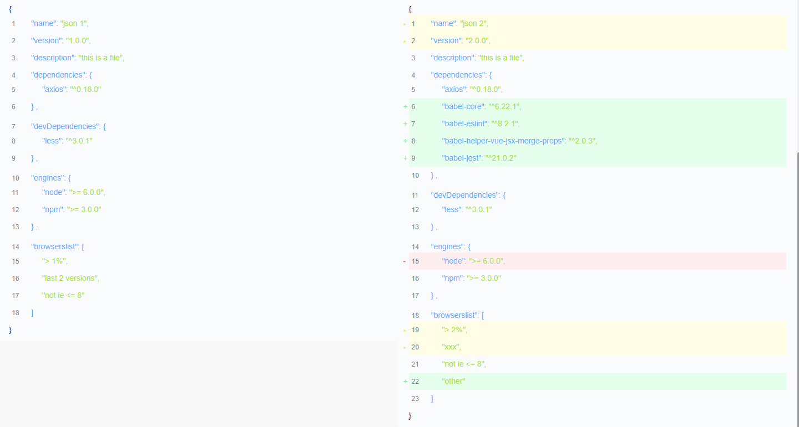

# vue-json-compare

[](https://github.com/5SSS/vue-json-compare)

A vue(2.x) components for compare JSON data

## Links

- [Github](https://github.com/5SSS/vue-json-compare)

## Install

```js
npm install --save vue-json-compare
```

## Usage

```html
<template>
  <div>
    <vue-json-compare :oldData="oldData" :newData="newData"></vue-json-compare>
  </div>
</template>
```

```js
import vueJsonCompare from 'vue-json-compare'

export default {
  components: {
    vueJsonCompare
  },
  data () {
    return {
      oldData: {
        a: 1,
        e: 0
      },
      newData: {
        a: 2
        b: 3
      }
    }
  }
}
```

## Example

注意：左边是使用了[vue-json](https://github.com/5SSS/vue-json)这个包,纯展示使用的。右边的才是vue-json-compare展示的结果。
(left: vue-json-cool component, right: vue-json-compare component)



## Props

| Attribute | Level | Description | Type | Default |
|-------- |-------- |-------- |-------- | -------- |
| oldData | basic | json data | JSON object or object Array, {...}, [{...}, {...}] | - |
| newData | basic | json data | JSON object or object Array, {...}, [{...}, {...}] | - |

## Events

not yet...

## PS

如果喜欢请给个星星，谢谢。
If you like, please give me a star, thank you.

如果需要帮助: QQ:1573815240 邮箱: 1573815240@qq.com
if you need help: QQ:1573815240 email: 1573815240@qq.com